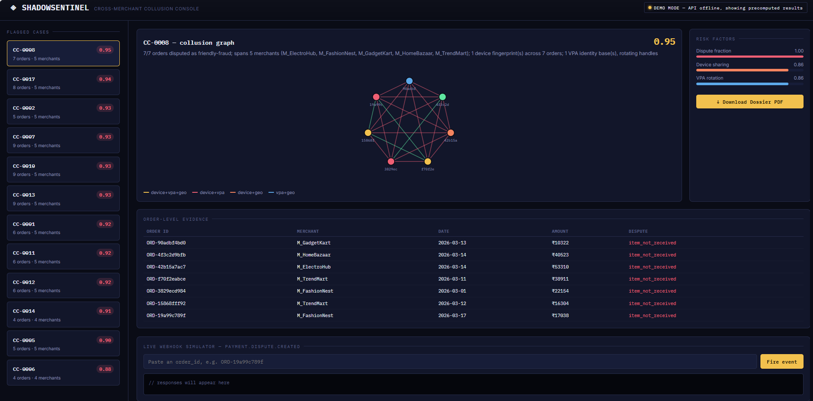
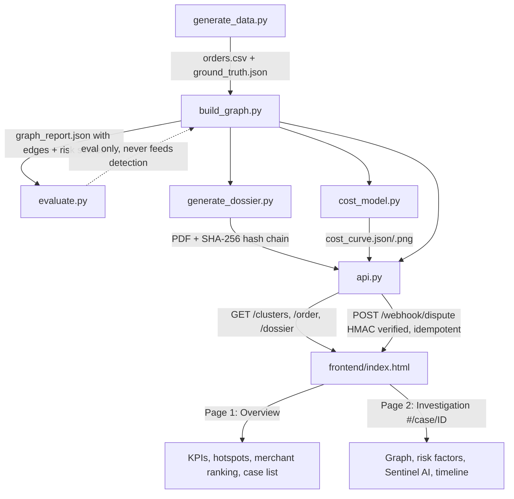

# ShadowSentinel
Cross-Merchant Friendly-Fraud Collusion Graph & Auto-Dossier Compiler

Built for Razorpay AI Buildathon 2026 — Track 02: AI Risk Manager

**[Live demo dashboard →](https://mehrunisha1011.github.io/shadowsentinel/frontend/index.html)**
(runs in demo mode against precomputed results — no setup needed)



## The problem
Friendly fraud: a syndicate orders high-value goods, accepts delivery, then
claims "item not received" and files a chargeback — rotating UPI handles and
devices across multiple merchants so no single merchant sees the pattern.

## Approach
Most naive detectors check one order in isolation (IP country, single device
flag). That misses cross-merchant collusion by design. ShadowSentinel instead
builds a **graph** across orders and looks for connected clusters that share
device fingerprints, fuzzy-rotating UPI handles, and tight delivery geography
— then scores each cluster on an explainable, weighted formula (not a
black-box classifier) so every flag comes with a human-readable reason.

## Pipeline
```
src/generate_data.py   -> synthetic orders + held-out ground truth
src/build_graph.py     -> graph construction + component risk scoring
src/evaluate.py        -> precision/recall/F1 against ground truth (eval-only)
src/generate_dossier.py -> PDF evidence packet + SHA-256 hash chain for a flagged cluster
src/cost_model.py      -> economic threshold sweep (INR cost vs. flag threshold)
src/api.py             -> FastAPI webhook layer: HMAC-signed, idempotent, ties it all together
```

## Architecture



## Try it live
The `frontend/index.html` dashboard is deployed via GitHub Pages:
**https://mehrunisha1011.github.io/shadowsentinel/frontend/index.html**

It opens in DEMO MODE by default (embedded precomputed results, no backend
needed). To see it running against the real live API instead:
```bash
cd src
uvicorn api:app --port 8000
```
then open `frontend/index.html` directly in a browser — it auto-detects the
running API and switches to LIVE mode, letting you fire real
`payment.dispute.created` webhook events and download dossiers on demand.

## Security & reliability (webhook layer)
- **HMAC-SHA256 signature verification** on `/webhook/dispute` — if a caller
  sends `X-Webhook-Signature`, it's cryptographically verified against the
  raw request body; an invalid signature is rejected with 401. Requests with
  no signature at all still work (so the live demo and any existing caller
  aren't broken) but are honestly flagged `"signature_verified": false/None`
  rather than silently trusted.
- **Idempotency** — firing the same `order_id` twice within 60 seconds
  returns the identical cached response instead of reprocessing, the
  standard safe pattern for webhook retries/duplicates.
- **SHA-256 evidence hash chain** in every generated dossier — each order
  record is hashed and chained to the previous record's hash. Tampering
  with any single record changes every hash after it, which is tested
  directly in `tests/test_dossier_hash_chain.py`.
- Honesty note: the webhook demo secret is intentionally visible in
  `frontend/index.html` so the live demo can compute a real signature
  client-side. A real deployment would never ship a secret to the browser —
  this is stated in the code comments, not hidden.

## Tests
```bash
pip install pytest
python3 -m pytest tests/ -v
```
13 tests, including two that directly regression-test the multi-signal-edge
bug described below (over-merging at `min_signals=1` vs. correct separation
at `min_signals=2`) — not just a coverage number, but a proof that the fix
documented in ARCHITECTURE.md actually holds.

## Running it
```bash
python3 -m venv venv
source venv/bin/activate
pip install -r requirements.txt

cd src
python3 generate_data.py --outdir ../data
python3 build_graph.py --orders ../data/orders.csv --out ../data/graph_report.json
python3 evaluate.py --report ../data/graph_report.json --ground-truth ../data/ground_truth.json --orders ../data/orders.csv
```

## Key design decision: multi-signal edges
Early version connected orders on ANY single shared signal (device OR geo OR
VPA). This over-merged unrelated orders: incidental geo overlap (two
strangers ordering from the same apartment block) chained a real fraud ring,
a legit household, and unrelated orders into one 37-node blob. Fixed by
requiring **at least 2 independent signals** to agree before drawing an edge.
See `ARCHITECTURE.md` for the full before/after.

## Status
Day 1 result on synthetic data: 12/12 rings detected, 0/6 false-positive
household traps wrongly flagged. This is a clean-data result and is being
treated as a starting point, not a claim — next step is adversarial/noisy
test cases before this number goes in the pitch.

## Not yet built
- Neo4j persistence (currently networkx, in-memory — not needed at this scale, documented as a future step)
